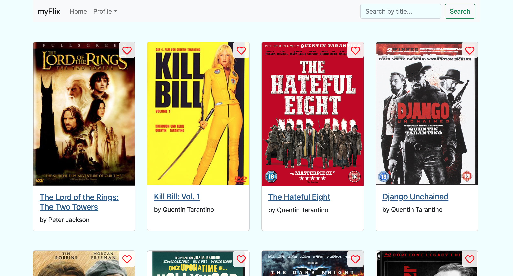

# myFlix Client

A single-page, responsive app with routing, rich interactions, several interface views,
and a polished user experience. The client-side developed in this repo supports
the existing [server-side](https://github.com/kjb92/myFlix) by facilitating user requests and rendering the
response from the server-side via a number of different interface views.



# Table of Contents

1. [Getting Started](#getting-started)
2. [Technical Requirements](#technical-requirements)
3. [Features](#features)
4. [Built With](#built-with)


# Getting started

## Live Test-Version
For a live test version of the API, simply go to `myflix-kjb92.netlify.app`

## Clone the repo
Follow the instructions below to get a copy of the project up and running on your local machine for development and testing purposes:

1. Open your terminal and navigate to the directory where you want to clone the repository.
2. Clone the repository:
```bash
git clone https://github.com/kjb92/myFlix-client.git
```

2. Navigate to the root directory of the project.
3. Run `npm install` to install all dependencies.
4. Run parcel to build the project with `npm run start`
5. Open a web browser and navigate to `http://localhost:1234` to access the front-end


# Technical requirements
- MERN stack must be used (React library)
- the myFlix App
  - must use Parcel as its build tool
  - must be a single page application (SPA)
  - must be written in ES2015+
  - must contain function components
  - must use state routing to navigate
  - must use React Bootstrap (components, styling, responsivenss (Grid))
  - must include search feature (filter movie list)
  - must be hosted online on Netlify
  - may use React Redux for state management of at least one feature (i.e.,
filtering movies)

# Features
In this Movie App
- you are able to sign in (register as a new user), for this you need to pass
  - your username
  - a password
  - your email
  - your birth date
- once you are logged in with your username and password, you are able
  - to access information about movies
  - to create your own list of favorite movies in adding single movies to a (at start empty) list
  - to delete movies off of your list of favorite movies
  - to update your user information
  - to log out
  - to filter for a movie by title on home page (MainView)


# Built with
- HTML
- SCSS
- JavaScript, JSX

## Dependencies
- `bootstrap` to customize bootstrap sass files
- `prop-types` to transmit data between components and validate the data type based on the app's configuration
- `react` to use the react library
- `react-bootstrap` to use the react version of bootstrap modules
- `react-dom` to use as entry point to the DOM, intended to be paired with `react`

## Dev Dependencies
- `Parcel` parcel.js as the build tool
  - `@parcel/transformer-sass` automatically comes with parcel to support Sass files
  - `Process` automatically comes with parcel to improve functionality of built-in process module

